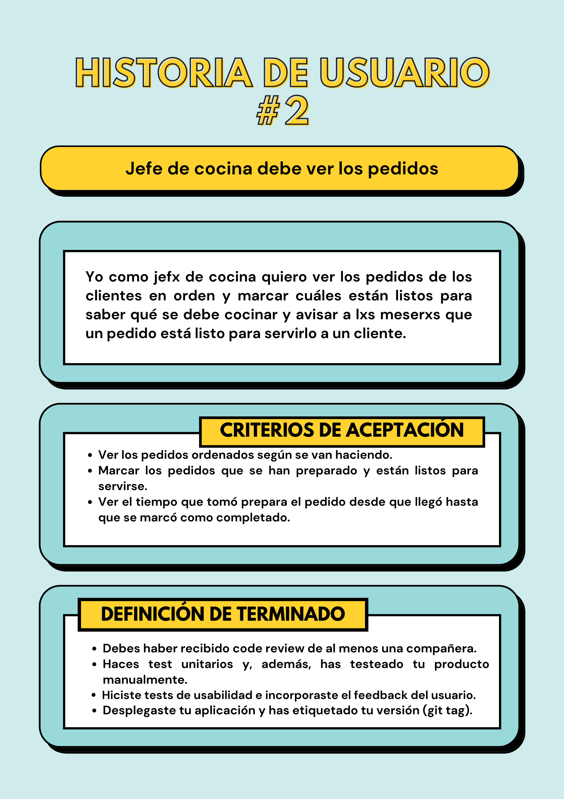
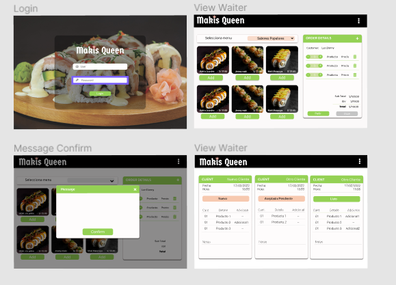

# Burger Queen

## Índice

- [1. Introducción]()
- [2. Resumen del proyecto]()
- [3. Consideraciones técnicas ]()
- [4. Definición del producto]()
- [5. Despliegue]()
- [6. Autoras]()

---

## 1. Introducción

Aplicación web para restaurante de makis, donde se toma pedidos a través de una tablet y enviarlos a cocina para que se preparen de
forma ordenada y eficiente. El proyecto consta de la interfaz (cliente) y se trabajó con Firebase como base de datos para las cuentas y pedidos realizados.

## 2. Resumen del proyecto

Makis Queen es un plataforma para la gestión de pedidos, con vistas para los siguientes roles: chef y mesero. El objetivo es brindar una herramienta con la(s) funcionalidad(es) requeridas.

Consta de una vista inicial para el ingreso a la plataforma con su respectivo correo. En el caso de nuestra plataforma se usaron dos correo:

- chef@makisqueen.com
- waiter@makisqueen.com
  Ambos con la siguiente contraseña: 123456.

Para el rol de mesero cuenta con la vista: Place Order, en la que podemos hacer el filtrado del tipo de menú disponible, así como un carrito de compra al costa del menú para mejorar la visualización del resumen de la orden. En el cual podemos agregar un producto, editar la cantidad de este y/o eliminarlo. De la misma forma, podemos agregar el nombre del cliente y la mesa respectiva ello para poder guardar el pedido. Como plus adicional podemos observar el subtotal, igv y el total del pedido a medida que vamos modificándolo.
El mesero cuenta con otra vista disponible: Order Status, en la cual puede observar el estado de los pedidos que se hayan realizado, de la misma forma puede escoger ver todos los pedidos en general, los listos para servir y los ya entregados.

## 3. Consideraciones técnicas

### 3.1. Tecnologías empleadas

- <a href="https://angular.io/">Angular</a>
- <a href="https://www.typescriptlang.org/">TypeScript</a>
- <a href="https://firebase.google.com/docs?authuser=0&hl=es">Firebase</a>
- <a href="https://getbootstrap.com/docs/5.1/getting-started/introduction/">Bootstrap</a>:
- <a href="https://sass-lang.com/documentation">SASS</a>
- <a href="https://www.netlify.com/">Netlify</a>

## 4. Definición del producto

---

---

## 

---

## 5. Ejecución del proyecto

### 5.1. Diseño

Integramos ATOMIC DESIGN como metodología de diseño del producto, esto nos permite verificar que cada elemento de la interfaz debe funcionar tanto de manera individual como en conjunto. Para llevar a cabo el desarrollo de los prototipos bajo esta metodología elegimos la herramienta FIGMA.

### 5.2. Prototipos

#### 5.2.1. Prototipo baja fidelidad

#### 5.2.2. Prototipo alta fidelidad

## 6. Despliegue

Para el despliegue de nuestra aplicación utilizamos NETLIFY el cual te permite crear, alojar y mantener tu sitio web con implementación continua.

[AppDesplegada]()

## 7. Autoras

### Luz Torres Villavicencio

- <code></code>

- <code></code>

### Pilar Rivera Romero

- <code></code>

- <code></code>
